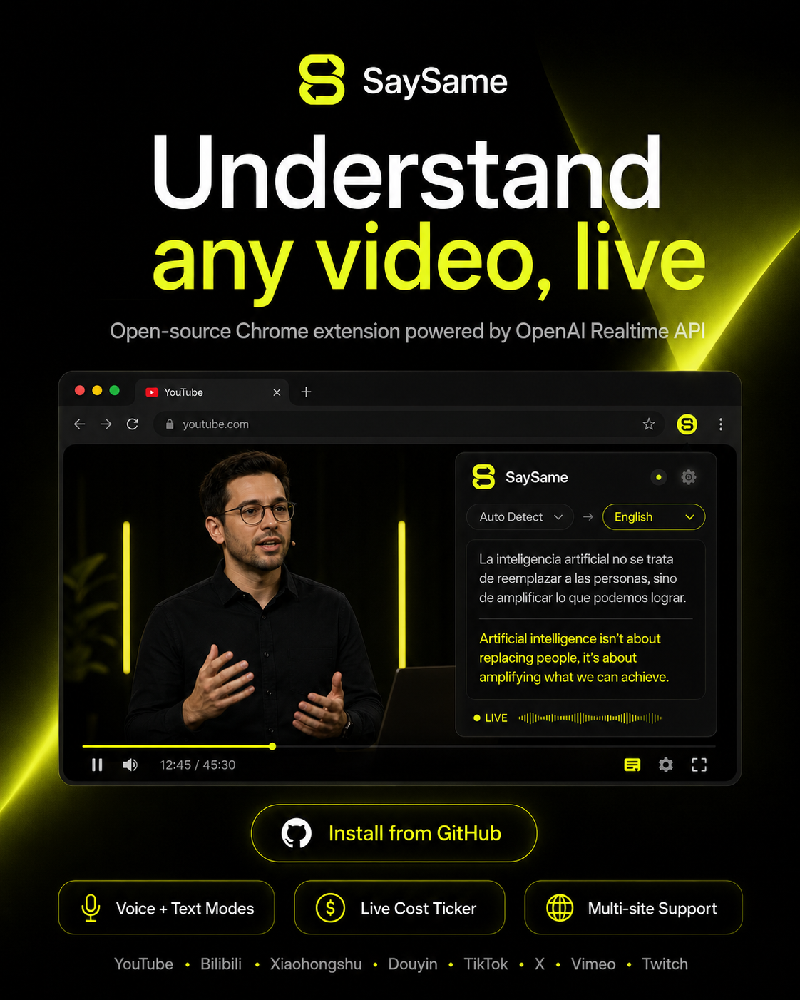

# SaySame

**Live-translate any video, in any language, in your browser.**

**SaySame is a Chrome extension that translates the audio of any video in REAL TIME — YouTube, Bilibili, Xiaohongshu, Douyin, anywhere — using OpenAI's Realtime API.** You watch, it listens, you understand. No subtitles required, no waiting for human captioners, no separate apps.

Built for people who watch videos in languages they don't speak: language learners, researchers tracking foreign news, developers reading Chinese tech tutorials, or anyone curious about content the rest of the internet can't access.

## What it does

- **Voice mode** (~$0.034/min) — hear the translated speech alongside the original video.
- **Text mode** (~$0.02/min, ~40% cheaper) — see translated captions only, no voice generated.
- **Works on:** YouTube, Bilibili, Xiaohongshu (小红书), Douyin (抖音), Weibo, TikTok, Twitter/X, Vimeo, Twitch.
- **Live cost ticker** so you know what each session is costing you.
- **Resizable, draggable, transparent bar** so it doesn't get in the way of what you're watching.
- **Language switcher mid-session** — flip between English, Greek, Spanish, etc., without losing your session.
- **Show/hide captions toggle** in voice mode.

## What you need

- Google Chrome or any Chromium-based browser (Brave, Comet, Edge, Arc).
- An OpenAI API key with access to the Realtime API. Get one at [platform.openai.com](https://platform.openai.com/api-keys).
- A video on a supported site.

## Install

### Option A — From this repo (developer install)

1. Download or clone this repo.
2. Open `chrome://extensions`.
3. Enable **Developer mode** (top-right).
4. Click **Load unpacked**.
5. Select the `extension` folder.
6. Click the SaySame icon in your toolbar to open the bar.

### Option B — Chrome Web Store

Submitted and awaiting review. The listing link will go here once Google approves it. (First-time submissions with broad host permissions take 1–2 weeks.)

## How to use

1. Open a YouTube/Bilibili/Xiaohongshu/etc. video and press play.
2. Click the SaySame icon in your browser toolbar.
3. The first time: open the gear (⚙) → paste your OpenAI API key.
4. Pick **Voice** or **Text** mode.
5. Pick your target language ("Hear:").
6. Press **Start**.

The overlay sits at the bottom of the page. Drag it where you want, resize it, change transparency, hide it to a small pill — your settings persist.

## Cost

You pay OpenAI directly for usage. Approximate per-minute costs:

| Mode | Per minute | Per hour |
|---|---|---|
| Voice | $0.034 | ~$2.04 |
| Text | $0.02 | ~$1.20 |

The bar shows a live `MM:SS · $X.XX` ticker so you always know what the current session is costing.

## API key safety

- Your API key is stored locally in your browser's extension storage.
- It's never sent to any server other than OpenAI's API endpoints.
- It's never sent to the page (YouTube/Bilibili/etc.).
- For maximum safety, create a dedicated OpenAI project key with a low monthly cap, just for this extension.

Full privacy policy: [PRIVACY.md](PRIVACY.md).

## Advanced — local bridge mode

If you'd rather not store your OpenAI key in the extension at all, you can run a tiny local relay server. See `src/server.js` and the older instructions in `extension/README.md`.

## Credits

SaySame is a fork of [petergpt/Live-YT-Translator](https://github.com/petergpt/Live-YT-Translator) (MIT License). The original made the YouTube voice-translation flow work; SaySame extended it to many more sites, added a cheaper text-only mode, redesigned the UI, and shipped a number of fixes.

## License

MIT — see `LICENSE`.
